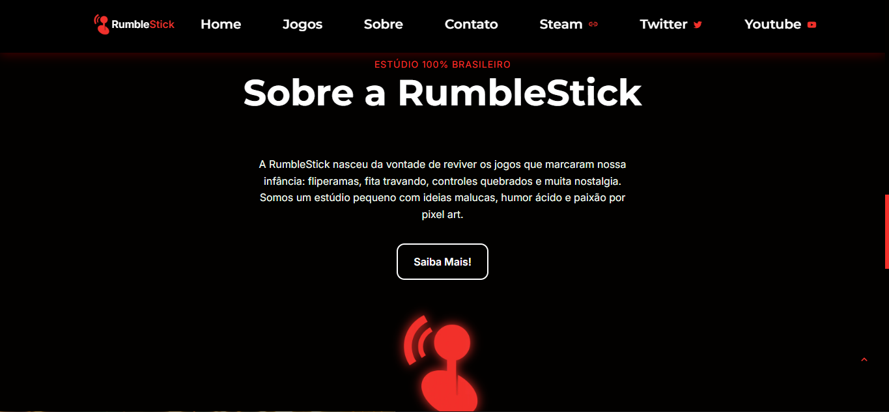

# Projeto: RumbleStick

## 1. Visão Geral do Projeto

O RumbleStick é um site fictício desenvolvido como parte do TCC do curso de informática da Microcamp. O objetivo principal deste projeto é apresentar uma empresa indie brasileira de jogos com uma identidade cultural forte e um toque de humor.

## 2. Especificações Técnicas e Detalhes da Arquitetura

### Estrutura de Pastas

```
/assets         # Contém imagens, ícones e mídias
/css            # Estilos personalizados
/js             # Scripts de interatividade
index.html      # Página principal
jogos.html      # Página de apresentação dos jogos
sobre.html      # Página sobre o estúdio
contato.html    # Página de contato
```

### Tecnologias Utilizadas

- HTML5
- CSS3
- JavaScript
- Biblioteca para Carrossel: Swiper.JS

## 3. Dependências e Requisitos

- Um navegador web moderno (Chrome, Firefox, Edge, etc.)
- Editor de texto (Visual Studio Code, Sublime Text, etc.)

## 4. Instruções de Instalação/Configuração

Para configurar o projeto em seu ambiente local, siga estas instruções:

1. **Clone o repositório**:
   ```bash
   git clone https://github.com/Davi-Tlr/RumbleStick.git
   ```

2. **Acesse o diretório do projeto**:
   ```bash
   cd RumbleStick
   ```

3. **Modifique os arquivos conforme necessário** para personalizar o conteúdo e a aparência.

4. **Abra o arquivo `index.html` em seu navegador** para visualizar o site.

5. **Publique o site** utilizando uma plataforma de hospedagem como o Netlify ou Vercel, se desejar.

## 5. Exemplos de Uso

O RumbleStick pode ser utilizado de várias maneiras:

### Apresentação de Portfólio

O layout pode ser adaptado para mostrar projetos reais de jogos ou produtos digitais, permitindo um portfólio atrativo.

### Landing Page de Estúdio Indie

Ideal para quem deseja criar uma identidade visual única e divertida, o site pode ser utilizado por estúdios de jogos indie para atrair a atenção de clientes e usuários.



## 6. Documentação de Funções/Métodos

Atualmente, não há uma API interna ou métodos complexos, uma vez que o site é estático. As interações são feitas através de funções JavaScript simples.

## 7. Tratamento de Erros e Solução de Problemas

### Problemas Comuns

- **O site não carrega**: Verifique se todos os arquivos HTML, CSS e JavaScript estão no lugar correto e se o caminho para os arquivos referenciados está correto.
- **Problemas de layout**: Certifique-se de que o CSS está sendo aplicado corretamente e que não há conflitos entre estilos.

### Solução de Problemas

Se você encontrar problemas, siga estas etapas:

1. Verifique o console do navegador para mensagens de erro.
2. Revise o código HTML e CSS para garantir que não haja erros de sintaxe.
3. Verifique as referências aos arquivos de mídia (imagens, ícones, etc.) para garantir que estejam corretas.

## 8. Conclusão

O RumbleStick oferece uma base divertida e única para qualquer estúdio indie que deseja se destacar online. Com a estrutura fácil de usar e a possibilidade de personalização, ele se torna uma ferramenta valiosa para a promoção de jogos e estúdios criativos.

Para mais informações, sinta-se à vontade para acessar o projeto em tempo real no seguinte link: [RumbleStick](https://rumblestick.netlify.app/).
